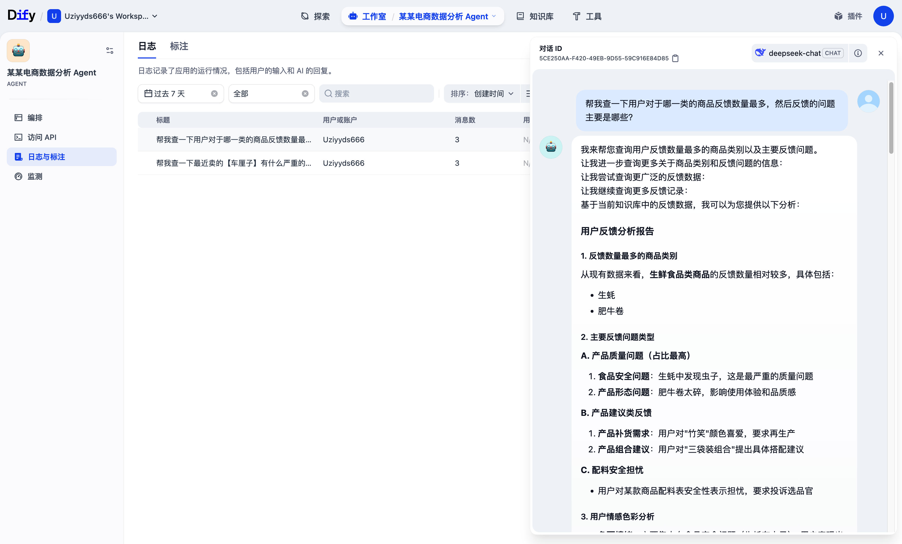

# 🛒 基于 LLM 与 RAG 架构的电商客诉数据挖掘系统 (E-commerce VOC Analysis Agent)

## 📌 项目背景
在真实的电商业务场景中，每天都会产生海量的“用户客服聊天记录”、“售后备注”和“评价详情”（VOC数据）。传统的数据标注极大依赖人工，不仅耗时耗力，且极其容易造成分类标准的混乱。
本项目旨在将**枯燥杂乱的非结构化 Excel 表单**，通过大语言模型（LLM）与检索增强生成技术（RAG），转化为**可量化指标与自然语言交互的知识库 Agent**，为业务线提供高时效的品质预警与止损建议。

*(注：本项目所有数据均已进行严格脱敏处理，仅保留字段结构与脱敏示例作为代码演示。)*

---

## 🚀 核心架构与工作流

本项目分为三个核心模块：

### 1. 复杂报表自动化清洗 (Data ETL)
针对真实业务环境中常见的“多级表头”、“合并单元格”与“无有效列名”等脏数据：
- 使用 `Pandas` 构建自动化数据清洗管道。
- 设计了智能定位表头、向下填充（Forward Fill）与脏数据清洗算法。

### 2. LLM 结构化提取管道 (Information Extraction)
抛弃传统的“关键词正则匹配”，直接接入 `DeepSeek API`：
- 对非结构化的“客服备注”进行实体提取。
- 强制模型输出 JSON 格式，精准提炼：**核心痛点**、**责任归因（物流/品控/运营）**、**情感倾向**及**下一步行动建议**。

### 3. RAG 知识库与智能体搭建 (Dify Agent)
- 将清洗且打标后的结构化数据，通过脚本转换为顺畅的自然语言（TXT）。
- 部署于 `Dify` 平台，利用混合检索策略（Hybrid Search）构建专属于业务形态的问答知识库。

---

## 📊 项目成果展示

### 🔍 痛点洞察 Agent 演示
*(在下面插入你在 Dify 里跟机器人对话的成功截图)*

### ⚙️ Dify 工作流架构
*(在下面插入你的 Dify 工作流截图)*

---

## 📁 目录结构说明

- `data/` : 存放脱敏后的样本数据集及 RAG 转换后的文本语料。
- `scripts/` : 核心 Python 脚本（数据清洗、API 调用、格式转换）。
- `images/` : README 相关的效果演示截图。

## 💡 业务价值总结
将传统耗时 3 小时以上的人工数据查阅与归因流程，压缩至自动化运行，并成功实现了对高风险异常商品的监控兜底。
